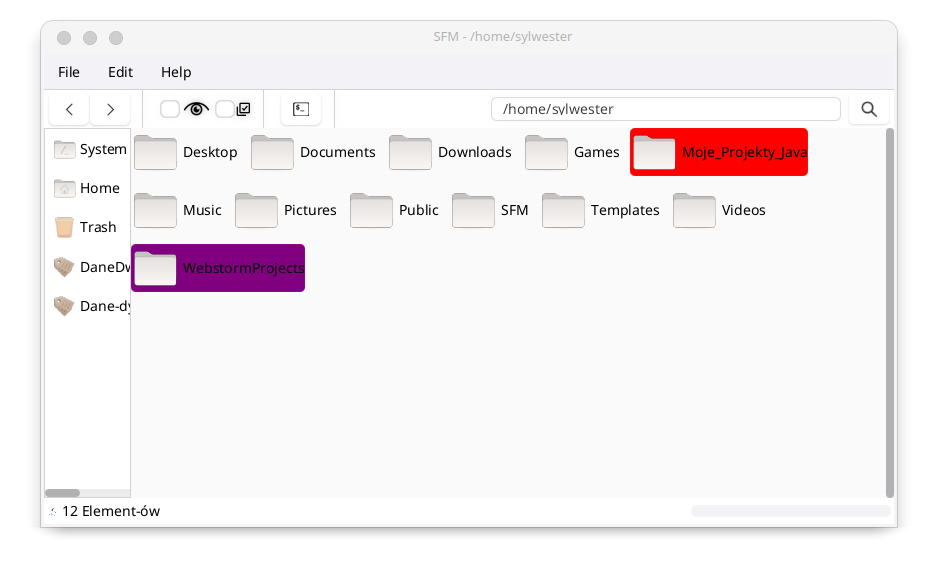
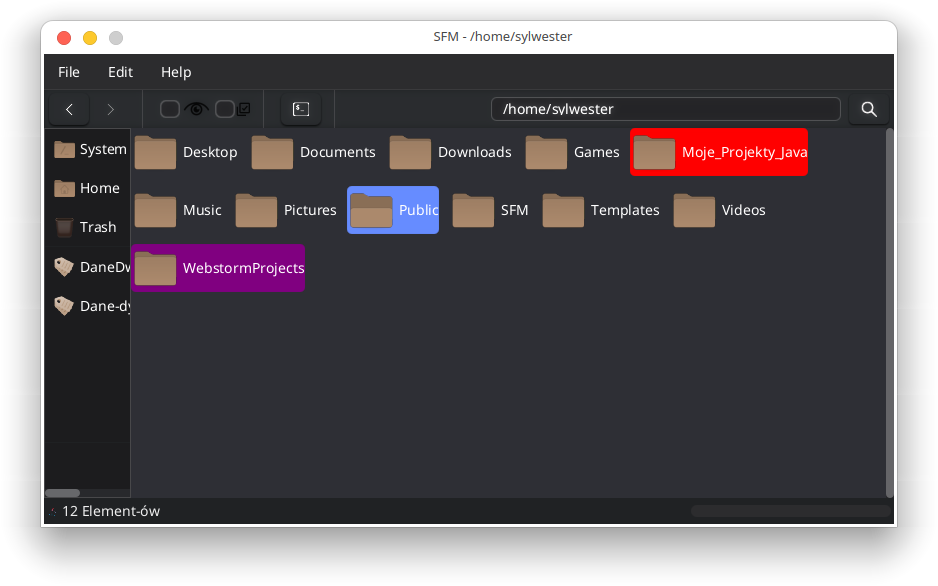
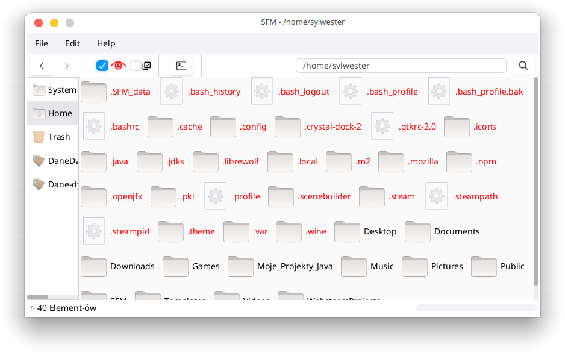
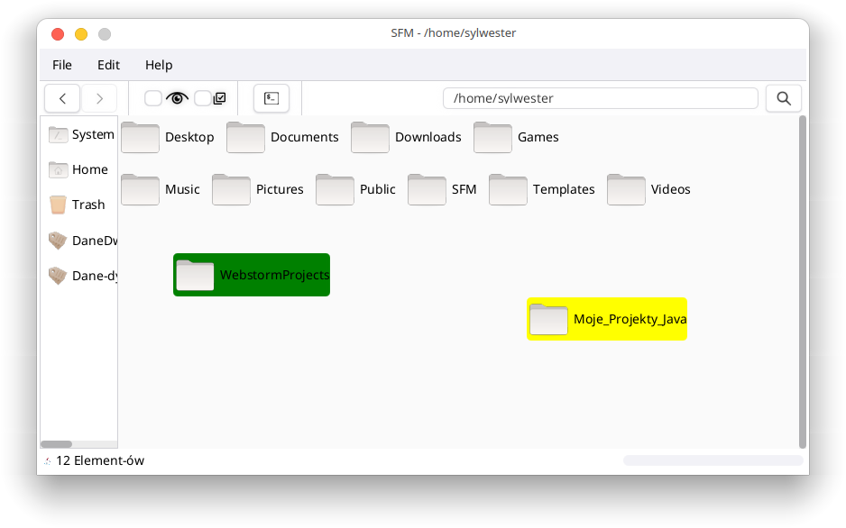

_Program Name: SylwesterFileManager (SFM)_

**Version: 0.9.0.7**

**Release Date: [10.12.2025]**

**About:**

SylwesterFileManager (SFM) is a lightweight file management application for Linux distributions.  
It allows users to:  
- Browse and manage files and directories with an intuitive interface  
- Move, copy, delete, and rename files and folders  
- Highlight important directories with custom colors  
- Assign programs to specific files to open them with a chosen application  
- Launch a terminal in the current directory, either directly or by clicking on a folder  
- View real-time progress when loading directories
- Optionally, configure folders so that they can be freely moved and remain in a fixed position "image 4"

SFM is still in development

**Installation Instructions:**

    Download and Extract:

    Download the archive containing the latest release of SylwesterFileManager. Then extract the contents of the archive to any location on your system.

    Running the Program:

    Open a terminal and navigate to the directory where you extracted the files. Run the init.bin file using the following command:

    sh init.bin

    Installing SFM:

    After running the init.bin file, the SFM program will be installed on your system.

    Replacing the File Manager:

    To set SylwesterFileManager as the default file manager, follow the appropriate steps in your system settings to replace the default file manager with SFM.

    Done!

    After completing the above steps, SylwesterFileManager is ready to use. Enjoy the improved file management capabilities!

**Screenshots:**

**Known Issues:**

The program currently does not detect the available space in the system trash, which may prevent some files from being moved there. This issue will be fixed in a future update. Planned improvements also include adding the ability to display available devices in the bookmark list.
